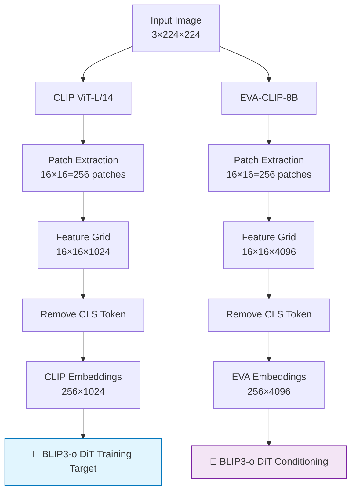
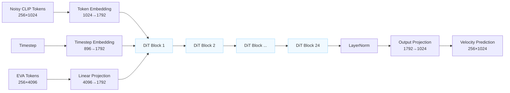
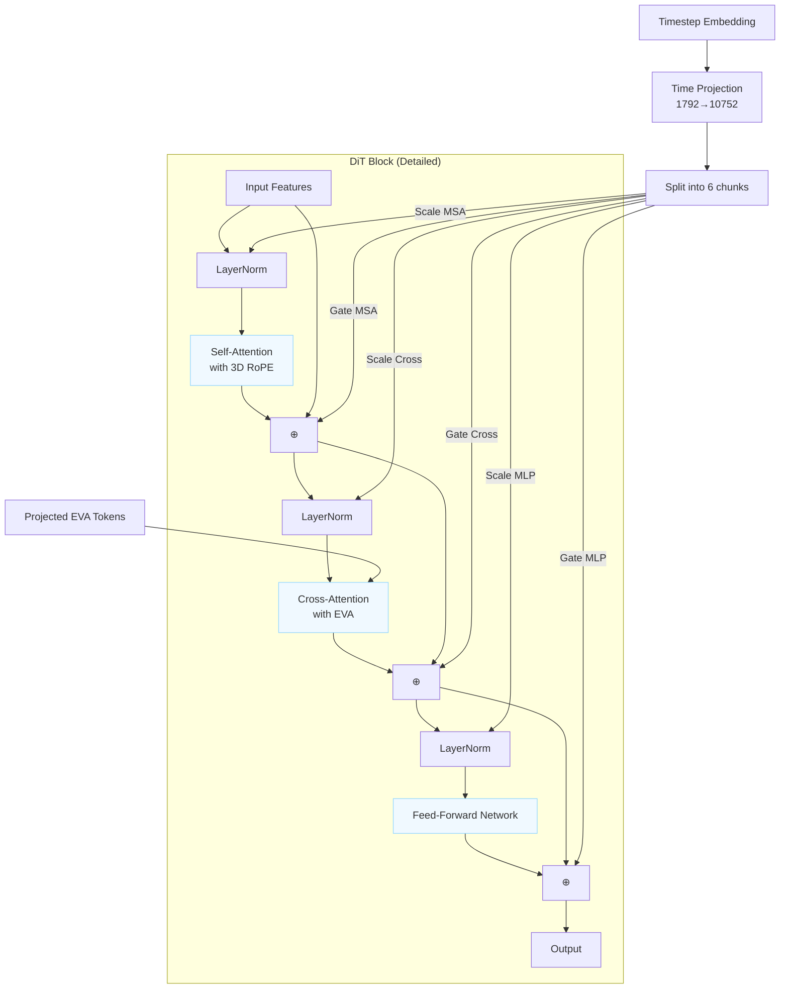
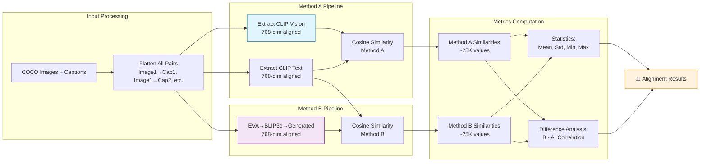
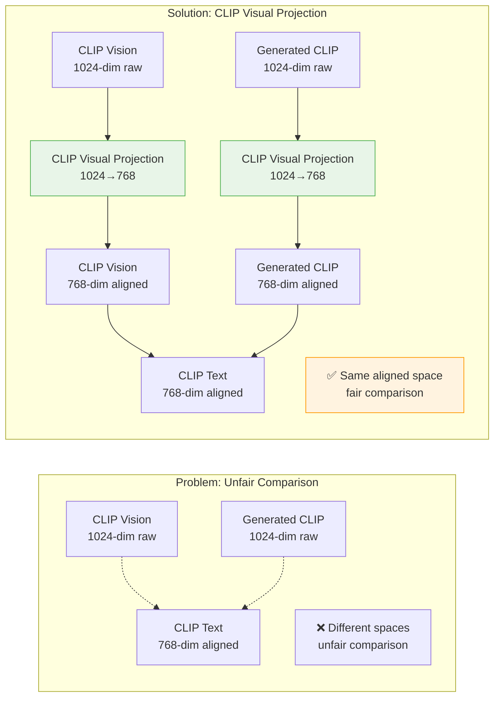

# BLIP3-o DiT: Flow Matching for CLIP Embedding Generation

A PyTorch implementation of the BLIP3-o Diffusion Transformer architecture with flow matching for generating CLIP embeddings from EVA-CLIP conditioning. This implementation follows the exact methodology described in the BLIP3-o paper with comprehensive evaluation framework.

## 🚀 Overview

This repository implements:
- **BLIP3-o DiT Model**: NextDiT-based architecture for embedding generation
- **Flow Matching Training**: Velocity prediction with optimal transport paths  
- **EVA-CLIP → CLIP**: Maps 4096-dim EVA features to 1024-dim CLIP embeddings
- **256-Token Format**: Compatible with 16×16 grid embeddings (updated from 64-token)
- **HuggingFace Integration**: Custom trainer with full training pipeline
- **Comprehensive Evaluation**: Fair comparison framework with CLIP visual projection
- **SLURM Support**: Cluster-ready training and evaluation scripts

## 📁 Project Structure

```
blip3o-dit/
├── src/
│   ├── __init__.py
│   └── modules/
│       ├── __init__.py
│       ├── config/
│       │   ├── __init__.py
│       │   └── blip3o_config.py         # Model & training configurations
│       ├── models/
│       │   ├── __init__.py
│       │   ├── blip3o_dit.py           # Main BLIP3-o DiT model
│       │   └── lumina_nextdit2d.py     # NextDiT backbone
│       ├── losses/
│       │   ├── __init__.py
│       │   └── flow_matching_loss.py   # Flow matching loss implementation
│       ├── datasets/
│       │   ├── __init__.py
│       │   └── blip3o_dataset.py       # Dataset loading utilities
│       ├── trainers/
│       │   ├── __init__.py
│       │   └── blip3o_trainer.py       # Custom HuggingFace trainer
│       ├── inference/
│       │   ├── __init__.py
│       │   └── blip3o_inference.py     # Inference utilities
│       └── evaluation/
│           ├── __init__.py
│           ├── evaluator.py            # Main evaluation pipeline
│           ├── metrics.py              # Evaluation metrics
│           └── coco_dataset.py         # COCO dataset loader
├── train_blip3o_dit.py                 # Main training script
├── evaluate_alignment.py              # Task 1: Alignment evaluation
├── evaluate_recall.py                 # Task 2: Recall evaluation
├── job_scripts/
│   ├── train.job                      # SLURM training script
│   └── evaluate.job                   # SLURM evaluation script
├── requirements.txt                    # Project dependencies
└── README.md                          # This file
```

## 🏗️ Architecture Overview

### Embedding Extraction Flow


### BLIP3-o DiT Architecture


### DiT Block Architecture


## 🛠️ Installation

1. **Clone and setup environment:**
```bash
git clone <your-repository>
cd blip3o-dit
conda create -n eva_clip_env python=3.11 -y
conda activate eva_clip_env
```

2. **Install dependencies:**
```bash
pip install -r requirements.txt
```

## 📊 Data Preparation

### Dataset Requirements
- **MS-COCO 2017 Validation**: For evaluation (~5K images with captions)
- **Pre-extracted Embeddings**: EVA-CLIP and CLIP embeddings for training

### Preparation Steps

1. **Download MS-COCO 2017 Validation**
```bash
# Download validation images (1GB)
wget http://images.cocodataset.org/zips/val2017.zip
unzip val2017.zip -d ./data/coco/images/

# Download annotations (1MB)  
wget http://images.cocodataset.org/annotations/annotations_trainval2017.zip
unzip annotations_trainval2017.zip -d ./data/coco/
```

2. **Extract Grid Embeddings**
```bash
# GPU-intensive step - recommend using SLURM
python src/module/extract_embeddings_g.py
```

This generates `embeddings/blip3o_grid_embeddings.pkl` containing:
- `eva_blip3o_embeddings`: `[N, 256, 4096]` — EVA-CLIP conditioning
- `clip_blip3o_embeddings`: `[N, 256, 1024]` — CLIP targets

### Expected Directory Structure
```
data/
├── coco/
│   ├── images/
│   │   └── val2017/
│   │       ├── 000000000139.jpg
│   │       └── ...
│   └── annotations/
│       └── captions_val2017.json
└── embeddings/
    └── blip3o_grid_embeddings.pkl
```

## 🎯 Training

### Quick Start
```bash
python train_blip3o_dit.py \
  --embeddings_path embeddings/blip3o_grid_embeddings.pkl \
  --output_dir ./checkpoints/blip3o-dit \
  --num_epochs 10 \
  --batch_size 32 \
  --learning_rate 1e-4 \
  --fp16 \
  --gradient_checkpointing
```

### SLURM Training
```bash
sbatch job_scripts/train.job
```

### Model Architecture Parameters

| Parameter | Default | Description |
|-----------|---------|-------------|
| `model_dim` | 1792 | Hidden dimension |
| `num_layers` | 24 | Transformer layers |
| `num_heads` | 28 | Attention heads |
| `eva_embedding_size` | 4096 | EVA-CLIP dimension (fixed) |
| `in_channels` | 1024 | CLIP dimension (fixed) |
| `input_size` | 16 | Grid size (16×16=256 tokens) |

### Flow Matching Parameters

| Parameter | Default | Description |
|-----------|---------|-------------|
| `sigma_min` | 1e-4 | Minimum noise level |
| `sigma_max` | 1.0 | Maximum noise level |
| `prediction_type` | "v_prediction" | Velocity prediction |
| `schedule_type` | "linear" | Noise schedule |

## 📈 Evaluation Framework

### Overview

The evaluation framework provides comprehensive assessment using two key tasks with **fair comparison methodology**:

- **Task 1**: Alignment Evaluation (Cosine Similarity)
- **Task 2**: Recall Evaluation (Image-to-Text Retrieval)

Both tasks use **CLIP's visual projection** to ensure fair comparison in the aligned 768-dimensional embedding space.

### Evaluation Pipeline
```mermaid
flowchart TD
    subgraph "Evaluation Data"
        A[MS-COCO Val2017\n~5K images\n~25K captions] --> B[Image-Caption Pairs]
        B --> C[Each image: up to 5 captions]
    end
    
    subgraph "Method A: CLIP Baseline"
        D[Image] --> E[CLIP ViT-L/14\nVision Encoder]
        E --> F[Patch Embeddings\n256×1024]
        F --> G[Average Pooling\n1×1024]
        G --> H[CLIP Visual Projection\n1024→768]
        H --> I[CLIP Vision Features\n768-dim aligned]
    end
    
    subgraph "Method B: Generated CLIP"
        D --> J[EVA-CLIP-8B\nVision Encoder]
        J --> K[Patch Embeddings\n256×4096]
        K --> L[BLIP3-o DiT\nGeneration]
        L --> M[Generated CLIP\n256×1024]
        M --> N[Average Pooling\n1×1024]
        N --> O[CLIP Visual Projection\n1024→768]
        O --> P[Generated Features\n768-dim aligned]
    end
    
    subgraph "Text Processing"
        Q[Captions] --> R[CLIP Text Encoder]
        R --> S[Text Features\n768-dim aligned]
    end
    
    subgraph "Fair Comparison"
        I --> T[Task 1: Alignment\nCosine Similarity]
        P --> T
        S --> T
        
        I --> U[Task 2: Recall\nImage-to-Text Retrieval]
        P --> U
        S --> U
    end
    
    T --> V[Alignment Metrics]
    U --> W[Recall@K Metrics]
    
    style H fill:#e8f5e8,stroke:#4caf50
    style O fill:#e8f5e8,stroke:#4caf50
    style T fill:#fff3e0,stroke:#ff9800
    style U fill:#fff3e0,stroke:#ff9800
```

### Task 1: Alignment Evaluation


### Task 2: Recall Evaluation
```mermaid
flowchart TB
    subgraph "Data Preparation"
        A[COCO Images + Captions] --> B[Build Gallery\nAll unique captions\n~25K text embeddings]
        A --> C[Build Queries\nAll images\n~5K image embeddings]
        C --> D[Track Image→Caption\nMapping for evaluation]
    end
    
    subgraph "Method A: CLIP Vision"
        E[Query Images] --> F[CLIP Vision Pipeline\n768-dim aligned]
        F --> G[Image Embeddings A\n5K × 768]
    end
    
    subgraph "Method B: Generated CLIP"
        E --> H[EVA→BLIP3o Pipeline\n768-dim aligned]
        H --> I[Image Embeddings B\n5K × 768]
    end
    
    subgraph "Retrieval Process"
        G --> J[Similarity Matrix A\n5K × 25K]
        B --> J
        
        I --> K[Similarity Matrix B\n5K × 25K] 
        B --> K
        
        J --> L[Top-K Retrieval A\nfor each K ∈ {1,5,10}]
        K --> M[Top-K Retrieval B\nfor each K ∈ {1,5,10}]
    end
    
    subgraph "Metrics Computation"
        L --> N[Check Correct Retrievals A\nusing Image→Caption mapping]
        M --> O[Check Correct Retrievals B\nusing Image→Caption mapping]
        
        N --> P[Recall@K Metrics A]
        O --> Q[Recall@K Metrics B]
        
        P --> R[Comparison:\nB - A, Relative Change %]
        Q --> R
    end
    
    R --> S[📊 Recall Results]
    
    style F fill:#e1f5fe,stroke:#0277bd
    style H fill:#f3e5f5,stroke:#7b1fa2
    style S fill:#fff3e0,stroke:#ff9800
```

### Fair Comparison Methodology

**🎯 Key Innovation**: Both methods are compared in **CLIP's aligned 768-dimensional embedding space**



### Running Evaluation

#### Individual Tasks
```bash
# Task 1: Alignment Evaluation
python evaluate_alignment.py \
  --blip3o_model_path ./checkpoints/blip3o-dit \
  --coco_root ./data/coco \
  --batch_size 32 \
  --save_detailed

# Task 2: Recall Evaluation  
python evaluate_recall.py \
  --blip3o_model_path ./checkpoints/blip3o-dit \
  --coco_root ./data/coco \
  --batch_size 32 \
  --k_values 1 5 10 \
  --save_detailed
```

#### Complete Evaluation (SLURM)
```bash
# Update model path in job_scripts/evaluate.job
sbatch job_scripts/evaluate.job
```

### Evaluation Metrics

#### Task 1: Alignment Metrics

| Metric | Description |
|--------|-------------|
| `mean_cosine_similarity` | Average text-image alignment |
| `difference_mean` | Performance difference (Method B - Method A) |
| `correlation` | Correlation between methods |
| `embedding_space` | Confirms 768-dim aligned space |
| `uses_visual_projection` | Confirms fair comparison |

#### Task 2: Recall Metrics

| Metric | Description |
|--------|-------------|
| `recall@1` | Top-1 retrieval accuracy |
| `recall@5` | Top-5 retrieval accuracy |  
| `recall@10` | Top-10 retrieval accuracy |
| `recall@k_difference` | Performance difference per K |
| `recall@k_relative_change` | Relative improvement % |

## 🎛️ Key Features

### Technical Improvements
- ✅ **Fair Comparison**: CLIP visual projection ensures both methods compete in aligned space
- ✅ **Literature Compliance**: Follows CLIP's standard evaluation methodology  
- ✅ **Comprehensive Metrics**: Alignment similarity + retrieval recall
- ✅ **Scale Support**: Handles full COCO validation set (~5K images)
- ✅ **Robust Processing**: Device consistency, error handling, batch processing

### Evaluation Advantages
- **Meaningful Results**: Differences reflect actual model performance
- **Reproducible**: Deterministic evaluation with proper random seeds
- **Scalable**: Efficient batch processing with GPU acceleration
- **Detailed Analysis**: Per-sample results + aggregate statistics
- **Standard Metrics**: Industry-standard Recall@K and cosine similarity

## 📈 Monitoring

### Training (Weights & Biases)
- **Loss Components**: Flow matching loss, regularization
- **Quality Metrics**: Cosine similarity, L2 distance  
- **Model Statistics**: Output norms, gradient norms
- **Training Progress**: Learning rate, epoch, step

### Evaluation Results
- **Alignment Reports**: `alignment_summary.json`
- **Recall Reports**: `recall_summary.json` 
- **Detailed Data**: Per-sample embeddings and similarities
- **Comparison Analysis**: Method differences and correlations

## 🚀 Quick Start Example

```bash
# 1. Prepare data
python src/module/extract_embeddings_g.py

# 2. Train model
python train_blip3o_dit.py \
  --embeddings_path embeddings/blip3o_grid_embeddings.pkl \
  --output_dir ./checkpoints/blip3o-dit \
  --num_epochs 5 \
  --batch_size 16

# 3. Evaluate model
python evaluate_alignment.py \
  --blip3o_model_path ./checkpoints/blip3o-dit \
  --coco_root ./data/coco

python evaluate_recall.py \
  --blip3o_model_path ./checkpoints/blip3o-dit \
  --coco_root ./data/coco
```


## 📝 License

This project is licensed under the MIT License - see the [LICENSE](LICENSE) file for details.
