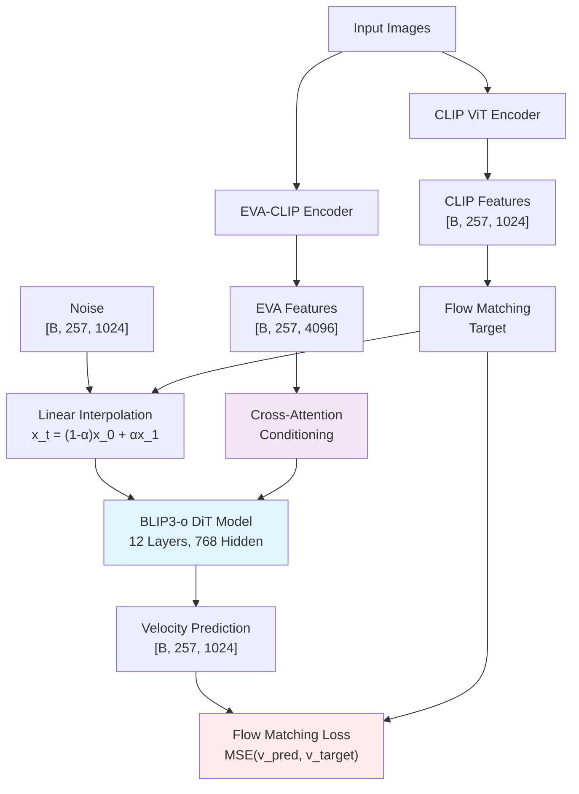

# BLIP3-o Enhanced Patch-Level DiT: Image-to-Text Translation via Flow Matching

An implementation of BLIP3-o patch-level Diffusion Transformer (DiT) for image-to-text translation using flow matching. This project implements flexible training with support for both **CLS+patch (257 tokens)** and **patch-only (256 tokens)** modes, with detailed cosine similarity evaluation and overfitting verification.

## 🏗️ Architecture Overview



## 🚀 Quick Start

### 1. Installation

```bash
# Clone repository
git clone <your-repo-url>
cd eva-clip-flow-matching/eva-clip-v3

# Create conda environment
conda create -n eva_clip_env python=3.11 -y
conda activate eva_clip_env

# Install dependencies
pip install torch torchvision transformers datasets
pip install accelerate wandb tqdm pillow safetensors
pip install webdataset opencv-python scikit-learn
pip install matplotlib seaborn plotly pandas scipy
```

### 2. Extract Embeddings

```bash
# Extract patch-only embeddings (256 tokens per image)
python src/modules/extract_embeddings_g.py \
    --chunked_embeddings_dir "./embeddings/patch_only_256_tokens"

# OR extract CLS+patch embeddings (257 tokens per image)
python src/modules/extract_embeddings_g.py \
    --include_cls \
    --chunked_embeddings_dir "./embeddings/cls_patch_257_tokens"
```

### 3. Training

#### Basic Training (Patch-Only Mode)
```bash
python train_blip3o_enhanced.py \
    --chunked_embeddings_dir "./embeddings/patch_only_256_tokens" \
    --output_dir "./checkpoints/patch_only_training" \
    --training_mode "patch_only" \
    --num_epochs 10 \
    --batch_size 4
```

#### Training with CLS+Patch Mode
```bash
python train_blip3o_enhanced.py \
    --chunked_embeddings_dir "./embeddings/cls_patch_257_tokens" \
    --output_dir "./checkpoints/cls_patch_training" \
    --training_mode "cls_patch" \
    --num_epochs 10 \
    --batch_size 4
```

#### Advanced Training Options
```bash
python train_blip3o_enhanced.py \
    --chunked_embeddings_dir "./embeddings/patch_only_256_tokens" \
    --output_dir "./checkpoints/advanced_training" \
    --training_mode "patch_only" \
    --model_size "base" \
    --num_epochs 15 \
    --batch_size 8 \
    --learning_rate 1e-4 \
    --velocity_scale 0.1 \
    --output_scale 0.1 \
    --fp16 \
    --gradient_checkpointing
```

### 4. Evaluation

```bash
# Evaluate trained model with patch-wise cosine similarity
python eval_blip3o_patch_similarity.py \
    --model_path "./checkpoints/patch_only_training" \
    --chunked_embeddings_dir "./embeddings/patch_only_256_tokens" \
    --output_dir "./evaluation_results" \
    --num_samples 1000 \
    --same_data_eval \
    --normalize_embeddings
```

## 📊 Training Modes Comparison

| Feature | CLS+Patch Mode | Patch-Only Mode |
|---------|----------------|------------------|
| **Token Count** | 257 | 256 |
| **Input Format** | [CLS] + 16×16 patches | 16×16 patches only |
| **Token Layout** | [0]=CLS, [1:257]=patches | [0:256]=patches |
| **Use Case** | Full BLIP3-o alignment | Simplified training |

## ⚙️ Key Parameters

### Scaling Parameters (Critical for Performance)
- `--velocity_scale`: Scale factor for velocity targets (default: 0.1)
- `--output_scale`: Scale factor for model outputs (default: 0.1)

### Training Configuration
```python
training_config = {
    "training_mode": "patch_only",          # or "cls_patch"
    "model_size": "base",                   # tiny, small, base, large
    "num_epochs": 10,
    "batch_size": 4,
    "learning_rate": 1e-4,
    "velocity_scale": 0.1,                  # Critical scaling parameter
    "output_scale": 0.1,                    # Critical scaling parameter
    "fp16": True,
    "gradient_checkpointing": False,
}
```

## 📁 Core Project Structure

```
eva-clip-flow-matching/eva-clip-v3/
├── src/modules/
│   ├── models/
│   │   └── blip3o_patch_dit.py              # DiT model implementation
│   ├── losses/
│   │   └── blip3o_flow_matching_loss.py     # Flow matching loss
│   ├── trainers/
│   │   └── blip3o_unified_trainer.py        # Training logic
│   ├── datasets/
│   │   └── blip3o_dataset.py                # Dataset handling
│   ├── config/
│   │   └── blip3o_config.py                 # Model configurations
│   └── extract_embeddings_g.py              # Embedding extraction
├── train_blip3o_enhanced.py                 # Main training script
├── eval_blip3o_patch_similarity.py          # Evaluation script
└── README.md                                # This file
```

## 🧪 Evaluation Methodology

The evaluation implements patch-wise cosine similarity following this methodology:

1. **Per-patch cosine similarity**: Compute cosine similarity for each of the 256/257 patches
2. **Per-image average**: Average cosine similarities across all patches for each image
3. **Global average**: Average per-image similarities across all images to get overall performance

### Expected Results
- **Training pipeline working**: Overall cosine similarity > 0.3
- **Good performance**: Overall cosine similarity > 0.6
- **Excellent performance**: Overall cosine similarity > 0.8

## 🔧 Troubleshooting

### Common Issues

1. **Training fails with "eval_strategy" error**:
   - Fixed in the updated trainer code
   - Ensure you're using the latest version

2. **Low cosine similarity (<0.1)**:
   - Check scaling parameters (`velocity_scale`, `output_scale`)
   - Verify embeddings are properly extracted
   - Ensure correct training mode matches embeddings

3. **GPU memory issues**:
   - Reduce `batch_size`
   - Enable `gradient_checkpointing`
   - Use `fp16` training

4. **Multiprocessing errors**:
   - Set `num_workers=0` in dataloader
   - Fixed in the updated dataset code

### Performance Optimization

- Use `model_size="base"` for best performance/speed trade-off
- Enable `fp16` for faster training
- Use `gradient_checkpointing` for large models
- Start with `batch_size=4` and increase if GPU memory allows

## 📊 Monitoring Training

The training script provides detailed logging including:
- Loss progression
- Velocity cosine similarity
- Prediction vs target norm ratios
- Adaptive scaling information
- Training quality assessment

Look for these indicators of successful training:
- ✅ Decreasing loss
- ✅ Increasing velocity cosine similarity
- ✅ Stable norm ratios (~1.0)
- ✅ No scaling warnings

## 🎯 Next Steps

1. **Verify Training Pipeline**: Run training on 1 shard with same-data evaluation
2. **Scale Up**: Once pipeline works, train on full dataset
3. **Hyperparameter Tuning**: Adjust learning rate, scaling parameters
4. **Evaluation**: Test on held-out data for generalization

## 📄 License

This project is licensed under the MIT License - see the [LICENSE](LICENSE) file for details.

## 🔗 Related Work

- [BLIP3-o Paper](https://arxiv.org/abs/your-paper-id)
- [EVA-CLIP](https://github.com/baaivision/EVA/tree/master/EVA-CLIP)
- [CLIP](https://github.com/openai/CLIP)
- [Flow Matching](https://arxiv.org/abs/2210.02747)