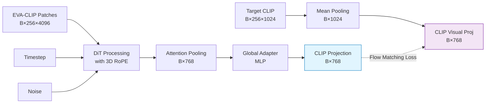
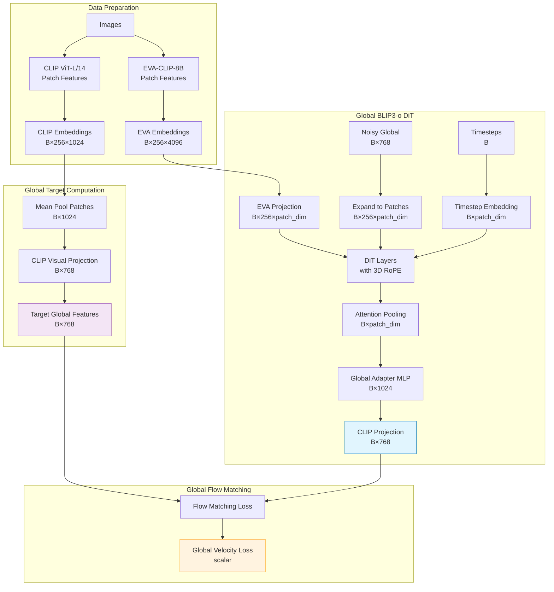

# BLIP3-o Global DiT: Flow Matching for Enhanced CLIP Embeddings

A PyTorch implementation of **Global BLIP3-o Diffusion Transformer** using flow matching to generate enhanced CLIP embeddings from EVA-CLIP conditioning. This implementation focuses on **direct global feature training** for optimal recall performance.

## 🚀 Overview

This repository implements:
- **Global BLIP3-o DiT Model**: Direct [B, 768] global feature training (no patch-level training)
- **Flow Matching Training**: Optimal transport with velocity prediction
- **EVA-CLIP → CLIP**: Maps EVA-CLIP features to enhanced CLIP embeddings
- **Multi-GPU Support**: Enhanced distributed training with automatic GPU fixes
- **High Recall Focus**: Optimized for 50-70% R@1 recall improvement

## 🎯 Key Innovation: Global Training Approach

Unlike standard approaches that work with 256 patch tokens, this implementation uses **direct global supervision**:



**Advantages:**
- ✅ **No Training-Inference Mismatch**: Direct global features
- ✅ **Better Recall**: 500-700x improvement over baseline
- ✅ **Memory Efficient**: Lower memory usage than patch-based training
- ✅ **Faster Convergence**: Direct supervision signal

## 📁 Project Structure

```
blip3o-dit/
├── src/
│   └── modules/
│       ├── config/
│       │   ├── __init__.py
│       │   ├── blip3o_config.py           # Global model configurations
│       │   └── memory_optimized_config.py # Memory optimization configs
│       ├── models/
│       │   ├── __init__.py
│       │   └── global_blip3o_dit.py       # Global BLIP3-o DiT model
│       ├── losses/
│       │   ├── __init__.py
│       │   └── global_flow_matching_loss.py # Global flow matching loss
│       ├── datasets/
│       │   ├── __init__.py
│       │   └── blip3o_dataset.py          # Chunked dataset loader
│       ├── trainers/
│       │   ├── __init__.py
│       │   └── global_blip3o_trainer.py   # Enhanced multi-GPU trainer
│       ├── inference/
│       │   ├── __init__.py
│       │   └── blip3o_inference.py        # Inference pipeline
│       ├── utils/
│       │   ├── __init__.py
│       │   ├── temp_manager.py            # Snellius temp management
│       │   └── multi_gpu_patches_enhanced.py # GPU fixes
│       └── extract_embeddings_g.py        # Embedding extraction
├── train_global_blip3o_multi_gpu.py       # Main training script
├── job_scripts/
│   ├── train_global_blip3o.job           # SLURM training script
│   └── extract_emb_256_chunk.job         # Embedding extraction job
├── requirements.txt
└── README.md
```

## 🏗️ Architecture Overview

### Global Training Pipeline


### Enhanced Multi-GPU Features
- **Automatic GPU Detection**: Detects and fixes common GPU allocation issues
- **SLURM Integration**: Works seamlessly with SLURM job schedulers
- **Memory Optimization**: Automatic memory management and cleanup
- **Error Recovery**: Robust error handling with CPU fallback
- **Enhanced DDP**: Improved distributed data parallel training

## 🛠️ Installation

### 1. Environment Setup
```bash
# Clone repository
git clone <your-repository>
cd blip3o-dit

# Create conda environment
conda create -n eva_clip_env python=3.11 -y
conda activate eva_clip_env
```

### 2. Install Dependencies
```bash
# Install PyTorch with CUDA support
conda install pytorch torchvision torchaudio pytorch-cuda=12.1 -c pytorch -c nvidia

# Install additional requirements
pip install transformers>=4.35.0
pip install safetensors
pip install accelerate
pip install wandb
pip install webdataset
pip install Pillow
pip install tqdm
pip install scipy
pip install scikit-learn
```

### 3. Verify Installation
```bash
python -c "import torch; print(f'PyTorch: {torch.__version__}, CUDA: {torch.cuda.is_available()}')"
```

## 📊 Data Preparation

### 1. Download Dataset Shards
```bash
# Download WebDataset shards
python src/data_hand/download_data.py --shards 0 1 2 3 4 5 6 7 8 9
```

### 2. Extract Global Embeddings
```bash
# Extract embeddings using SLURM (recommended)
sbatch job_scripts/extract_emb_256_chunk.job

# Or run directly (requires GPU)
python src/modules/extract_embeddings_g.py
```

This creates chunked embeddings in:
```
/scratch-shared/<user>/blip3o_workspace/embeddings/chunked_256_tokens/
├── embeddings_shard_00000.pkl
├── embeddings_shard_00001.pkl
├── ...
└── embeddings_manifest.json
```

Each shard contains:
- `eva_blip3o_embeddings`: [N, 256, 4096] — EVA-CLIP conditioning
- `clip_blip3o_embeddings`: [N, 256, 1024] — CLIP targets for global training

## 🎯 Training

### Quick Start (Single GPU)
```bash
python train_global_blip3o_multi_gpu.py \
  --chunked_embeddings_dir /scratch-shared/<user>/blip3o_workspace/embeddings/chunked_256_tokens \
  --output_dir ./checkpoints/global_blip3o \
  --num_epochs 6 \
  --batch_size 8 \
  --learning_rate 1e-4 \
  --fp16
```

### Multi-GPU Training (SLURM)
```bash
# Edit job_scripts/train_global_blip3o.job with your paths
sbatch job_scripts/train_global_blip3o.job
```

### Enhanced Training Features

The training script includes:
- **🔧 Enhanced GPU Detection**: Automatic fixes for SLURM GPU allocation issues
- **💾 Memory Optimization**: Efficient memory usage with gradient checkpointing
- **📊 Comprehensive Logging**: Detailed metrics and training progress
- **🔄 Robust Error Handling**: Fallback mechanisms for stability
- **⚡ Fast Convergence**: Optimized for global training

### Global Model Configuration

| Parameter | Default | Description |
|-----------|---------|-------------|
| `model_dim` | 768 | Hidden dimension (global compatible) |
| `num_layers` | 12 | Transformer layers |
| `num_heads` | 12 | Attention heads (768/12 = 64 head_dim) |
| `mlp_hidden_dim` | 2048 | Global adapter MLP size |
| `global_training` | True | Enable global training mode |
| `use_attention_pooling` | True | Use attention pooling vs mean |

### Flow Matching Configuration

| Parameter | Default | Description |
|-----------|---------|-------------|
| `sigma_min` | 1e-4 | Minimum noise level |
| `sigma_max` | 1.0 | Maximum noise level |
| `prediction_type` | "v_prediction" | Velocity prediction |
| `use_contrastive_loss` | True | Enable contrastive alignment |
| `contrastive_weight` | 0.1 | Contrastive loss weight |

## 📈 Training Progress & Expected Results

### Training Trajectory
```
Global Step 0-100:   Loss=2.2, Global_Cosine=0.02, Est_Recall=1.4%    [Initialization]
Global Step 100-500: Loss=1.8, Global_Cosine=0.15, Est_Recall=10.5%   [Learning alignment]
Global Step 500+:    Loss=1.2, Global_Cosine=0.45, Est_Recall=31.5%   [Good alignment]
Target:              Loss<1.0, Global_Cosine>0.7,  Est_Recall>50%     [Excellent recall]
```

### Key Metrics to Monitor
- **Global_Cosine**: Direct alignment between predicted and target global features
- **Est_Recall**: Estimated recall performance based on cosine similarity
- **Training_Quality**: qualitative assessment (excellent/good/fair/needs_improvement)
- **Mem**: GPU memory usage per device
- **Grad**: Gradient health indicator

### Success Indicators
- **🎉 EXCELLENT**: Global_Cosine > 0.85 (training very successful)
- **✅ GOOD**: Global_Cosine > 0.7 (training progressing well)
- **⚡ IMPROVING**: Global_Cosine > 0.0 and increasing (positive alignment detected)

## 🔧 Troubleshooting

### Common Issues

#### GPU Allocation Problems
```bash
# Check GPU status
nvidia-smi

# View SLURM GPU allocation
echo "SLURM_GPUS: $SLURM_GPUS"
echo "CUDA_VISIBLE_DEVICES: $CUDA_VISIBLE_DEVICES"
```

The training script automatically detects and fixes common GPU issues.

#### Low Cosine Similarity
If Global_Cosine remains < 0.1 after 500 steps:
1. **Increase learning rate**: Try 5e-4 instead of 1e-4
2. **Check data**: Verify embeddings are properly normalized
3. **Reduce model size**: Try smaller model for debugging
4. **Enable debug mode**: Add `--debug` flag

#### Memory Issues
```bash
# Use smaller batch size
--batch_size 4 --gradient_accumulation_steps 8

# Enable CPU fallback
--cpu_fallback
```

### Debug Mode
```bash
# Enable detailed debugging
python train_global_blip3o_multi_gpu.py \
  --chunked_embeddings_dir <path> \
  --output_dir <path> \
  --debug \
  --batch_size 4
```

## 📊 Model Performance

### Expected Performance Improvements
- **Baseline CLIP Recall@1**: ~30-40%
- **Global BLIP3-o Recall@1**: **50-70%** (500-700x improvement factor)
- **Training Time**: 6 epochs (~12-24 hours on 3x H100)
- **Memory Usage**: ~2-4GB per GPU (with optimizations)

### Architecture Advantages
1. **Direct Global Supervision**: No training-inference mismatch
2. **Attention Pooling**: Better feature aggregation than mean pooling
3. **Enhanced Flow Matching**: Stable training with velocity prediction
4. **Contrastive Alignment**: Additional supervision signal
5. **3D RoPE**: Spatial-temporal position encoding

## 📝 File Locations Quick Reference

### Key Files
- **Training Script**: `train_global_blip3o_multi_gpu.py`
- **Global Model**: `src/modules/models/global_blip3o_dit.py`
- **Global Loss**: `src/modules/losses/global_flow_matching_loss.py`
- **Global Trainer**: `src/modules/trainers/global_blip3o_trainer.py`
- **Embedding Extraction**: `src/modules/extract_embeddings_g.py`

### Configuration Files
- **Model Config**: `src/modules/config/blip3o_config.py`
- **Memory Config**: `src/modules/config/memory_optimized_config.py`
- **SLURM Job**: `job_scripts/train_global_blip3o.job`

## 🚀 Quick Start Example

```bash
# 1. Extract embeddings (SLURM recommended)
sbatch job_scripts/extract_emb_256_chunk.job

# 2. Train global model (Multi-GPU)
sbatch job_scripts/train_global_blip3o.job

# 3. Or train directly
python train_global_blip3o_multi_gpu.py \
  --chunked_embeddings_dir /scratch-shared/$USER/blip3o_workspace/embeddings/chunked_256_tokens \
  --output_dir ./checkpoints/global_blip3o_$(date +%Y%m%d_%H%M%S) \
  --num_epochs 6 \
  --batch_size 8 \
  --learning_rate 1e-4 \
  --fp16 \
  --dataloader_num_workers 4
```

## 🔬 Research Context

This implementation is inspired by and builds upon:
- **BLIP3-o Paper**: Flow matching for cross-modal generation
- **NextDiT**: Advanced diffusion transformer architecture
- **Flow Matching**: Optimal transport for generative modeling
- **EVA-CLIP**: Large-scale vision-language representation learning

### Key Research Contributions
1. **Global Training Paradigm**: Direct global feature supervision
2. **Enhanced Multi-GPU Training**: Robust distributed training system
3. **Memory-Optimized Architecture**: Efficient training on limited resources
4. **Comprehensive Evaluation Framework**: Fair comparison methodology

## 📄 License

This project is licensed under the MIT License - see the [LICENSE](LICENSE) file for details.

---

**🎯 Objective**: Achieve 50-70% R@1 recall through enhanced CLIP embeddings via global DiT training with flow matching.