# BLIP3-o EVA-CLIP Reproduction Project

A DiT-based implementation for reproducing EVA-CLIP embeddings using rectified flow matching.

## 🎯 Project Goal

Validate our DiT (Diffusion Transformer) architecture by testing if we can reproduce EVA-CLIP embeddings from noisy EVA embeddings using CLIP embeddings as conditioning.

## 🔄 Training Flow Diagram

```mermaid
graph TD
    A[EVA-CLIP Embeddings<br/>B, 256, 4096<br/>L2 Normalized] --> B[Add Noise<br/>t ~ U 0,1]
    B --> C[Noisy EVA Embeddings<br/>x_t = 1-t·noise + t·eva]
    
    D[CLIP Embeddings<br/>B, 256, 1024<br/>L2 Normalized] --> E[DiT Model<br/>Conditioning]
    
    C --> F[DiT Forward Pass]
    E --> F
    G[Timestep t] --> F
    
    F --> H[Velocity Prediction<br/>v_pred: B, 256, 4096]
    
    H --> I[Rectified Flow Loss<br/>MSE v_pred, eva - noise]
    
    I --> J[Backpropagation]
    
    K[Inference: ODE Integration<br/>x_0 noise → x_1 eva] -.-> L[Generated EVA]
    L -.-> M[Cosine Similarity<br/>with Target EVA]
```



## 🚀 Quick Start

### 1. Extract Embeddings
```bash
python src/modules/extract_embeddings_g.py --max_shards 10 --batch_size 16
```

### 2. Test Overfitting (Recommended First Step)
```bash
python train_eva_repro.py \
    --chunked_embeddings_dir /path/to/embeddings/patch_only_256_tokens \
    --output_dir ./checkpoints/overfit_test \
    --overfit_test_size 10 \
    --num_epochs 200 \
    --learning_rate 5e-4 \
    --batch_size 8 \
    --eval_every_n_steps 20
```

### 3. Full Training
```bash
python train_eva_repro.py \
    --chunked_embeddings_dir /path/to/embeddings/patch_only_256_tokens \
    --output_dir ./checkpoints/eva_repro \
    --num_epochs 100 \
    --learning_rate 5e-4 \
    --batch_size 64 \
    --eval_every_n_steps 50 \
    --use_wandb
```

## 📊 Expected Results

| Metric | Poor | Good | Excellent |
|--------|------|------|-----------|
| Velocity Similarity | <0.01 | 0.1-0.3 | >0.3 |
| EVA Similarity | <0.05 | 0.1-0.3 | >0.3 |
| Loss | >1.0 | 0.1-0.5 | <0.1 |

## 🔧 Key Improvements in This Version

1. **Better Initialization**: Zero-initialized output layer for flow matching
2. **Loss Scaling**: 100x scaling for better gradient flow
3. **Higher Learning Rate**: 5e-4 instead of 1e-4
4. **Gradient Monitoring**: Track gradient norms and statistics
5. **Overfitting Test**: Validate model can learn on small subset
6. **Debugging Features**: Comprehensive logging and metrics

## 📁 Project Structure

```
blip3o_workspace/
├── src/
│   └── modules/
│       ├── models/
│       │   └── blip3o_eva_dit.py      # DiT architecture
│       ├── losses/
│       │   └── blip3o_eva_loss.py     # Flow matching loss
│       ├── trainers/
│       │   └── blip3o_eva_trainer.py  # Training logic
│       └── datasets/
│           └── blip3o_eva_dataset.py  # Data loading
├── train_eva_repro.py                 # Main training script
├── eval_blip3o_patch_similarity.py    # Evaluation script
└── README.md                          # This file
```

## 🐛 Troubleshooting

### Very Low Similarity (<0.01)
1. Run overfitting test on 10 samples
2. Check gradient norms (should be >0.001)
3. Verify L2 normalization (norms should be ~1.0)
4. Try higher learning rate (1e-3)

### Model Not Learning
1. Check loss is decreasing
2. Verify inputs are normalized
3. Enable debug mode: `--debug_mode`
4. Monitor gradients: `--track_gradients`

### Out of Memory
1. Reduce batch size
2. Enable gradient checkpointing: `--gradient_checkpointing`
3. Use smaller model: `--model_size small`

## 📈 Monitoring with WandB

Enable WandB tracking:
```bash
wandb login
python train_eva_repro.py ... --use_wandb --wandb_project my-project
```

Track metrics:
- `train/loss`: Training loss
- `train/velocity_similarity`: Velocity cosine similarity
- `eval/eva_similarity`: EVA reproduction quality
- `train/gradient_norm`: Gradient magnitudes

## 🎓 Understanding the Approach

1. **Rectified Flow**: Linear interpolation between noise and data
   - `x_t = (1-t)·noise + t·eva`
   - Velocity: `v = eva - noise`

2. **Conditioning**: CLIP embeddings guide the denoising process
   - Cross-attention between EVA features and CLIP features
   - CLIP provides semantic information

3. **Evaluation**: Cosine similarity between generated and target EVA embeddings
   - >0.7: High quality
   - >0.8: Very high quality
   - >0.9: Excellent quality

## 📝 Citation

This implementation is based on the BLIP3-o paper and rectified flow matching techniques.

## 🤝 Contributing

1. Test overfitting first to validate changes
2. Monitor gradient norms
3. Keep L2 normalization consistent
4. Document any architecture changes